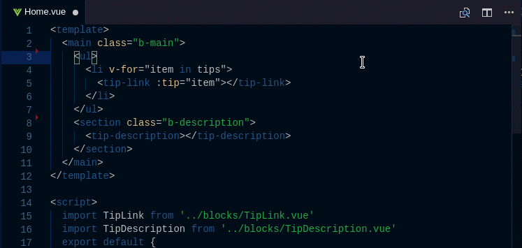

# vscode-vusion-peek
<!-- [](https://marketplace.visualstudio.com/items?itemName=dariofuzinato.vusion-peek)
[](https://travis-ci.org/chenzhongchen27/vscode-vusion-peek) -->

This extension extends Vue code editing with `Go To Definition` and `Peek Definition` support for components and filenames in single-file components with a *`.vue`* extension.
It allows quickly jumping to or peeking into files that are referenced as components (from template), or as module imports (from script).


## Features

The extension supports all the normal capabilities of symbol definition tracking, but does it for css selectors (classes and IDs). This includes:

 * Peek: load the css file inline and make quick edits right there. (`Ctrl+Shift+F12`)
 * Go To: jump directly to the css file or open it in a new editor (`F12`)
 * Hover: show the definition in a hover over the symbol (`Ctrl+hover`)

## Customize supported languages
There are 2 settings options that allows you to customize targeted files and language in which plugin is activated. By default they look like this:
```
 "vusion-peek.targetFileExtensions": [
    ".vue",
  ],
  "vusion-peek.supportedLanguages": [
    "vue"
  ]
```
You can add support for any file extension you like. To allow plugin to search for **.js** files: go to settings, search for _vusion-peek_ and add **.js** extension to _targetFileExtensions_ option.
If you'd like for plugin to be activated in other languages, add that extension (i.e. "js") to _supportedLanguages_ array.

## Contributing

Contributions and suggestions are greatly appreciated.

## Release Notes

### 1.0.2

  * Add config title
  * Add variable extension to `component/index` files

### 1.0.1

  * Fixes #1: referencing `component/index.vue` files

### 1.0.0

  * Initial release

### Thanks
Inspired by
[vscode file peek](https://github.com/abierbaum/vscode-file-peek)
[vscode vue peek](https://github.com/fussinatto/vscode-vusion-peek)

**Enjoy!**
